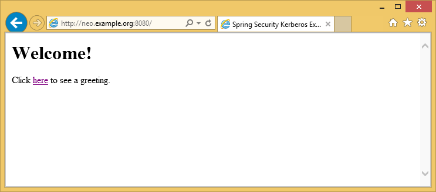
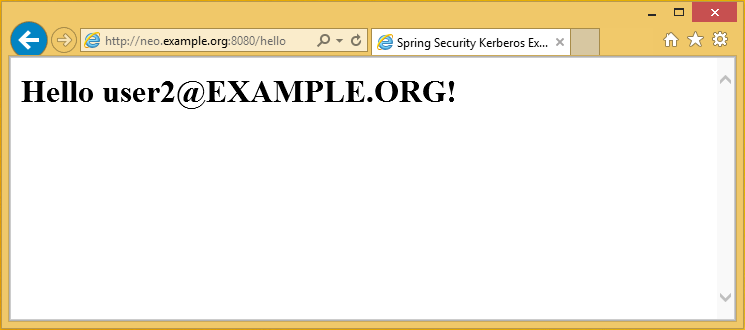
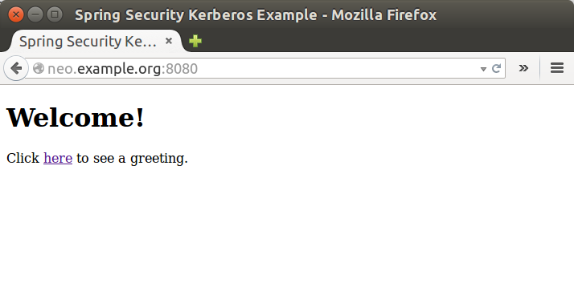
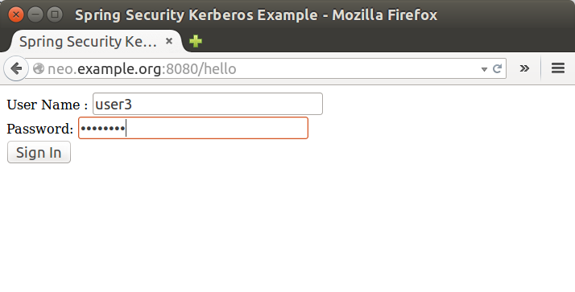
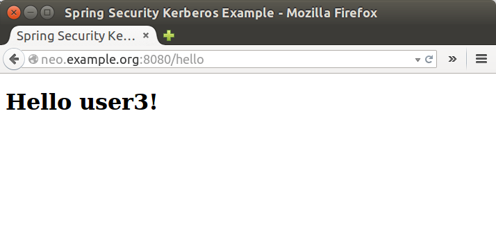

= Windows AD and Kerberos Sample

Goals of this sample:

- In windows environment, User will be able to logon to application
  with Windows Active directory Credential which has been entered
  during log on to windows. There should not be any ask for
  userid/password credentials.
- In non-windows environment, User will be presented with a screen
  to provide Active directory credentials.

[NOTE]
====
Your mileage with Kerberos, Windows and Linux will propably vary.
Based on my experience the moon, the planets and all stars beyond our
solar system needs to align for things to work meaning that one typo
or mistake somewhere or time skew on time will break things.
====

== Environment Setup
In this sample three vm's are used:

=== Windows Domain Controller
This was tested using `Windows Server 2012 R2`

- Normal domain controller and active directory setup was done.
- Used dns domain `example.org` and windows domain `EXAMPLE`.
- I created various domain users like `user1`, `user2`, `user3`,
  `tomcat` and set passwords to `Password#`.

I eventually also added all ip's of my vm's to AD's dns server for
that not to cause any trouble.
[source,text]
----
Name: WIN-EKBO0EQ7TS7.example.org
Address: 172.16.101.135

Name: win8vm.example.org
Address: 172.16.101.136

Name: neo.example.org
Address: 172.16.101.1
----

Service Principal Name(SPN) needs to be setup with `HTTP` and a server
name `neo.example.org` where tomcat servlet container is run. This is
used with `tomcat` domain user and its `keytab` is then used as a
service credential.
[source,text]
----
PS C:\> setspn -A HTTP/neo.example.org tomcat
----

I exported keytab file which is copied to linux server running tomcat.
[source,text]
----
PS C:\> ktpass /out c:\tomcat.keytab /mapuser tomcat@EXAMPLE.ORG /princ HTTP/neo.example.org@EXAMPLE.ORG /pass Password# /ptype KRB5_NT_PRINCIPAL /crypto All
 Targeting domain controller: WIN-EKBO0EQ7TS7.example.org
 Using legacy password setting method
 Successfully mapped HTTP/neo.example.org to tomcat.
----

=== Windows Host
This was tested using `Windows 8.1` with a normal installation.

- Joined this vm to `EXAMPLE` domain.
- Point dns server to domain controller
- In Internet Explorer add `http://neo.example.org` as a trusted local
  intranet site for Kerberos auth to kick on.

=== Linux Server
This was tested using `Ubuntu 14.10`. Doesn't really matter which
version but I used `jdk7`. Added other windows server ip's to
`/etc/hosts/`.

== Configuring Sample

You need to change application configuration to match your own
environment using `application.yml` file.
[source,text]
----
$ cat src/main/resources/application.yml
server:
    port: 8080
    app:
        ad-domain: EXAMPLE.ORG
        ad-server: ldap://WIN-EKBO0EQ7TS7.example.org/
        service-principal: HTTP/neo.example.org@EXAMPLE.ORG
        keytab-location: /home/jvalkealahti/tomcat.keytab
----

== Running Sample

From a parent folder compile a sample:
[source,text]
----
$ ./gradlew clean :sec-server-win-auth:build
----

You should see a Spring Boot executable jar
`sec-server-win-auth-1.0.0.BUILD-SNAPSHOT.jar`.
[source,text]
----
$ ls -lt sec-server-win-auth/build/libs/
total 17708
-rw-rw-r-- 1 jvalkealahti jvalkealahti 18077611 Mar  4 08:35 sec-server-win-auth-1.0.0.BUILD-SNAPSHOT.jar
-rw-rw-r-- 1 jvalkealahti jvalkealahti     2181 Mar  4 08:35 sec-server-win-auth-1.0.0.BUILD-SNAPSHOT-sources.jar
-rw-rw-r-- 1 jvalkealahti jvalkealahti    37469 Mar  4 08:35 sec-server-win-auth-1.0.0.BUILD-SNAPSHOT-javadoc.jar
-rw-rw-r-- 1 jvalkealahti jvalkealahti     6318 Mar  4 08:35 sec-server-win-auth-1.0.0.BUILD-SNAPSHOT.jar.original
----

[IMPORTANT]
====
This sample depends on a local snapshot of `spring-security-kerberos`.
You can install it to local maven repo by running commands:
[source,text]
----
$ git clone https://github.com/spring-projects/spring-security-kerberos.git
$ cd spring-security-kerberos
$ ./gradlew clean install
----
====

Run a Sample server:
[source,text]
----
$ java -Djava.security.krb5.conf=/home/jvalkealahti/krb5.ini -jar sec-server-win-auth/build/libs/sec-server-win-auth-1.0.0.BUILD-SNAPSHOT.jar
----

[NOTE]
====
You can also add `-Dsun.security.krb5.debug=true` to enable more
debugging. Currently we need to pass custom `krb5.ini` as a system
property if host default is not suiteable.
====

My `krb5.ini` file looks like this:
[source,text]
----
[libdefaults]
default_realm = EXAMPLE.ORG
default_keytab_name = /home/jvalkealahti/tomcat.keytab
default_tkt_enctypes = rc4-hmac
default_tgs_enctypes = rc4-hmac
forwardable=true

[realms]
EXAMPLE.ORG = {
  kdc = WIN-EKBO0EQ7TS7.example.org:88
}

[domain_realm]
example.org=EXAMPLE.ORG
.example.org=EXAMPLE.ORG
----

Login to `Windows 8.1` using domain credentials and access sample
application.

Access sample application from a non windows vm and use domain
credentials manually.

